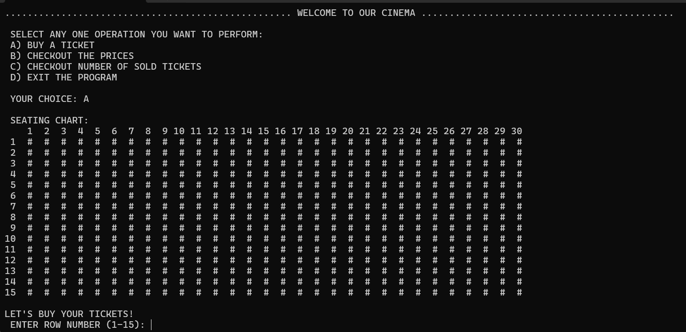

# 🎟️ Theatre Ticketing System (C++)

A simple console-based **Cinema Ticket Booking System** built in C++.  
Users can reserve seats, view ticket prices, check sold tickets, and see the updated seating chart.

---

## ✨ Features
- **Seat Reservation**: Choose a seat by row and column.  
- **Dynamic Pricing**:  
  - Rows 1–5 → 1500 PKR  
  - Rows 6–10 → 1000 PKR  
  - Rows 11–15 → 500 PKR  
- **Seating Chart**: Shows available (`#`) and reserved (`*`) seats.  
- **Sold Tickets Tracker**: Displays number of sold and available seats.  
- **Menu System**: Easy navigation with multiple options.  

---

## 🛠️ Technologies Used
- **Language**: C++  
- **Libraries**:  
  - `<iostream>` (input/output)  
  - `<iomanip>` (formatted display)  

---

## 🚀 How to Run
1. Clone the repository:
   ```bash
   git clone https://github.com/your-username/Theatre_Ticketing_System.git
   ```
2. Open up the file:
   ```bash
   cd Theatre_Ticketing_System
   ```
3. Compile the program:

   ```bash
   g++ main.cpp -o Theatre_Ticketing_System
   ```
4. Run the executable:

   ```bash
   ./Theatre_Ticketing_System
   ```
---

## 📸 Sample Output

```
::::::::::::::::::::::::::::::::::::::::::::::::::::::: CINEPAX CINEMA ::::::::::::::::::::::::::::::::::::::::::::::::
................................................... WELCOME TO OUR CINEMA .............................................

 SELECT ANY ONE OPERATION YOU WANT TO PERFORM:
 A) BUY A TICKET
 B) CHECKOUT THE PRICES
 C) CHECKOUT NUMBER OF SOLD TICKETS
 D) EXIT THE PROGRAM
```

---

## 🖼️ Screenshots / Preview



---

## 📚 Learning Outcomes

This project helps beginners practice:

* 2D arrays in C++
* Function decomposition
* Menu-driven programming
* Input validation

---

## 👨‍💻 Author

Developed by **Bilal Asif**


